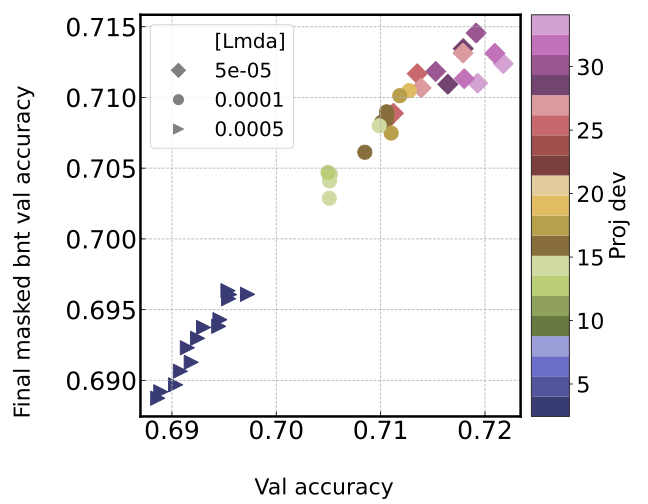
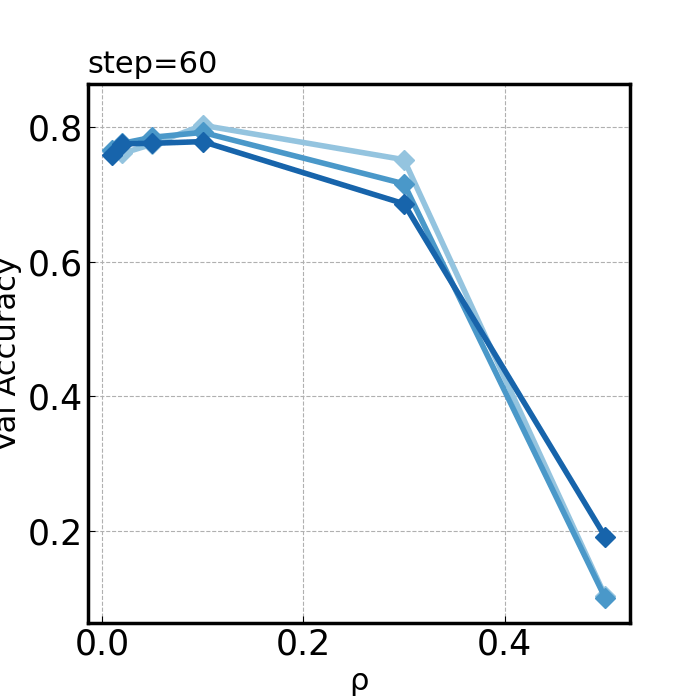
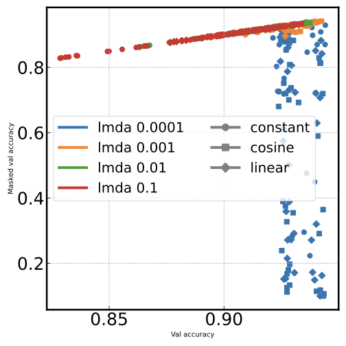
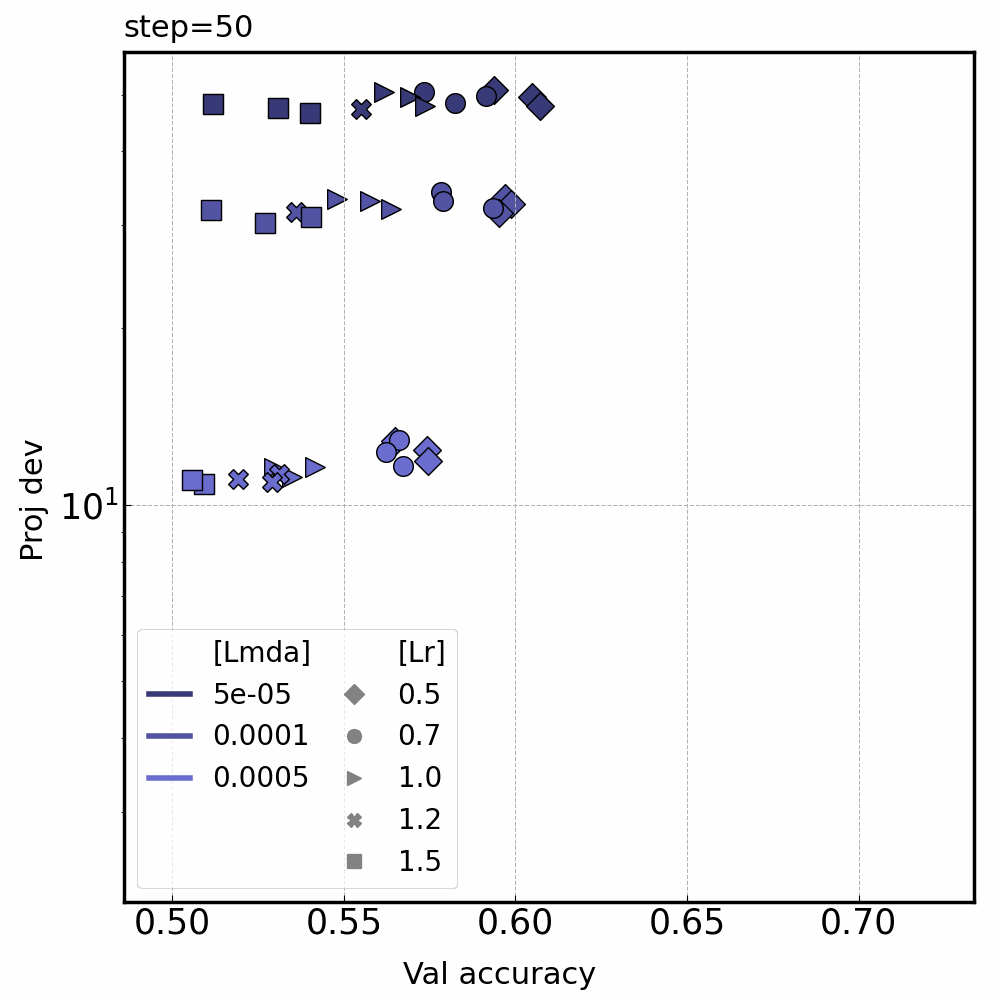
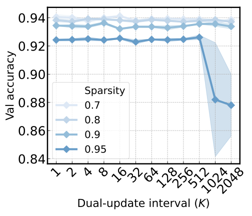
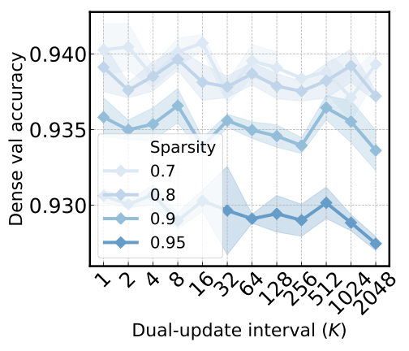
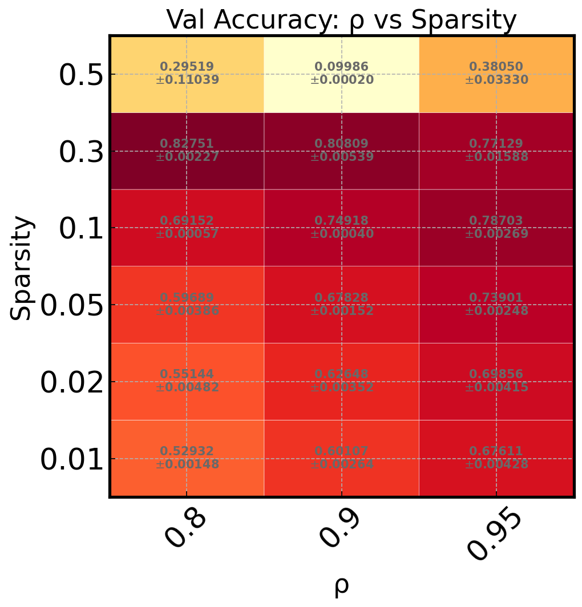
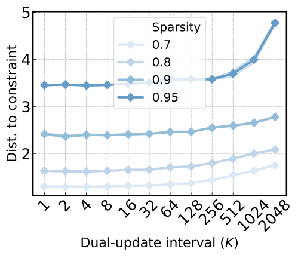

<p align="center">
  <picture>
    <source media="(prefers-color-scheme: dark)" srcset="docs/_static/logo/malet_white.svg">
    <source media="(prefers-color-scheme: light)" srcset="docs/_static/logo/malet.svg">
    
  </picture>
</p>

# Malet: a tool for machine learning experiment

**[Full Documentation](https://dongyeoplee2.github.io/Malet/)** | **[Changelog](CHANGELOG.md)**

**Malet** (short for **Ma**chine **L**earning **E**xperiment **T**ool) is a tool for hyperparameter grid searches, metric logging, advanced analyses and visualizations.

This is a pet project I'm developing for personal research, and it is yet unstable.
Kinda having fun with its architecture, cosmetics, and documentations.
Don't really know where this is going:)

## Gallery

<p align="center">
  
  
  
  
  
  
  
  
  
  
  
  
</p>

## Features

- 🔎 Easy & powerful hyperparameter grid search syntax
- 📝 Experiment metric logging and resuming system
- 📊 Flexible data process and visualization tools
- 🚀 Search parallelization for multi-gpus

## Installation

```bash
pip install malet
```

From source:

```bash
pip install git+https://github.com/dongyeoplee2/Malet.git
```

For development (uses [uv](https://docs.astral.sh/uv/)):

```bash
uv sync
```

## Quick Start

### 1. Prerequisite

#### Experiment Folder

Using Malet starts with making a folder with a single yaml config file.
Various files resulting from some experiment is saved in this single folder.
We advise to create a folder for each experiment under `experiments` folder.

```text
experiments/
└── {experiment folder}/
    ├── exp_config.yaml : experiment config yaml file            (User created)
    ├── log.tsv         : log file for saving experiment results (generated by malet.experiment)
    ├── (log_splits)    : folder for splitted logs               (generated by malet.experiment)
    └── figure          : folder for figures                     (generated by malet.plot)
```

#### Pre-existing training pipeline

Say you have some training pipeline that takes in a configuration (any object w/ dictionary-like interface).
We require you to return the result of the training so it gets logged.

```python
def train(config, ...):
    ...
    # training happens here
    ...
    metric_dict = {
        'train_accuracies': train_accuracies,
        'val_accuracies': val_accuracies,
        'train_losses': train_losses,
        'val_losses': val_losses,
    }
    return metric_dict
```

### 2. Running experiments

#### Experiment config yaml

You can configure as you would do in the yaml file.
But we provide useful special keyword `grid`, used as follows:

```yaml
# static configs
model: LeNet5
dataset: mnist

num_epochs: 100
batch_size: 128
optimizer: adam

# grided fields
grid:
  seed: [1, 2, 3]
  lr: [0.0001, 0.001, 0.01, 0.1]
  weight_decay: [0.0, 0.00005, 0.0001]
```

Specifying list of config values under `grid` lets you run all possible combination (_i.e._ grid) of your configurations, with field least frequently changing in the order of declaration in `grid`.

#### Running experiments

The following will run the `train_fn` on grid of configs based on `{exp_folder_path}` and `train_fn`.

```python
from functools import partial
from malet.experiment import Experiment

train_fn = partial(train, ...{other arguments besides config}..)
metric_fields =  ['train_accuracies', 'val_accuracies', 'train_losses', 'val_losses']
experiment = Experiment({exp_folder_path}, train_fn, metric_fields)
experiment.run()
```

Note that you need to partially apply your original function so that you pass in a function with only `config` as its argument.

#### Experiment logs

The experiment log will be automatically saved in the `{exp_folder_path}` as `log.tsv`, where the static configs and the experiment log are each saved in yaml and tsv like structure respectively.
You can retrieve these data in python using `ExperimentLog` in `malet.experiment` as follows:

```python
from malet.experiment import ExperimentLog

log = ExperimentLog.from_tsv({tsv_file})

static_configs = log.static_configs
df = log.df
```

Experiment logs also enable resuming to the most recently run config when a job is suddenly killed.

### 3. Plot making

Running `malet.plot` lets you make plots based on `log.tsv` in the experiment folder.

```bash
malet-plot \
-exp_folder ../experiments/{exp_folder} \
-mode curve-epoch-train_accuracy
```

The key intuition for using this is to _leave only two fields in the dataframe for the x-axis and the y-axis_ by

1. **specifying a specific value** (\_e.g.\_ther hyperparameters),

which will leave only one value for each field.

Available plot modes: `curve`, `curve_best`, `bar`, `heatmap`, `scatter`, `scatter_heat`.

For the full list of CLI arguments, plot configuration options, advanced gridding, parallel GPU training, checkpointing, and more, see the **[full documentation](https://dongyeoplee2.github.io/Malet/)**.

## Citation

If you find Malet useful, please cite it as:

```bibtex
@software{lee2024malet,
  author       = {Dongyeop Lee},
  title        = {Malet: Machine Learning Experiment Tool},
  year         = {2024},
  url          = {https://github.com/dongyeoplee2/Malet},
}
```
